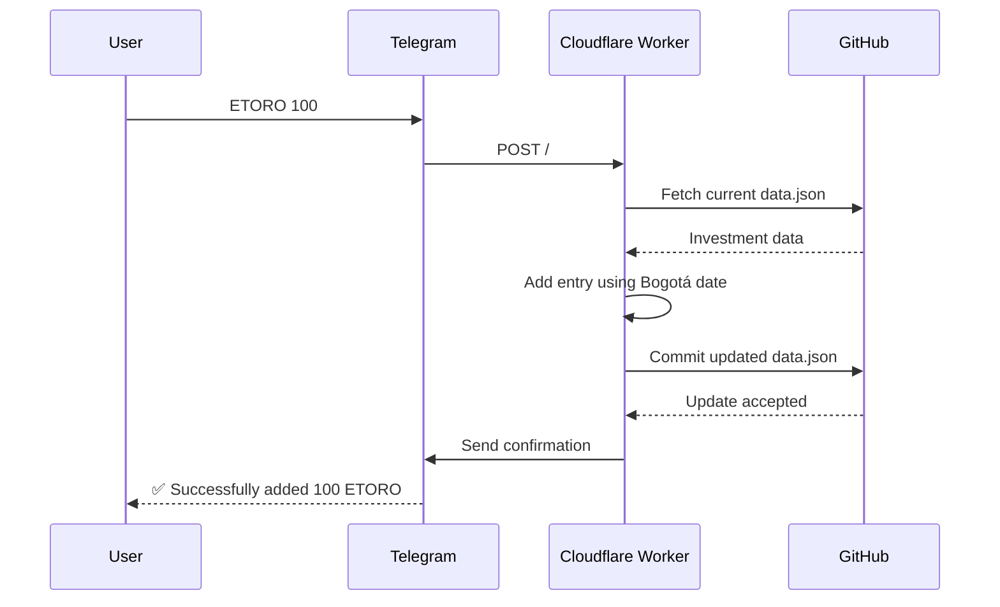

# update-investment-data

A Rust [Cloudflare Worker](https://developers.cloudflare.com/workers/languages/rust/) that receives investment entries from a Telegram bot and commits them to this repository's [`priv/data/data.json`](../../priv/data/data.json) file.

```text
Telegram message     Cloudflare Worker       GitHub repository
"ETORO 100"    ───▶ parse + date entry ───▶ priv/data/data.json
      ▲                       │
      └──── confirmation ─────┘
```

## How it works



The Worker accepts these providers:

- `ETORO`
- `XTB`
- `A2CENSO`
- `BRICKSAVE`
- `TRII`

Commands are case-sensitive and use this format:

```text
PROVIDER AMOUNT
```

For example:

```text
ETORO 100
```

This appends and date-sorts an entry shaped like:

```json
{
  "date": "2025-02-08",
  "amount": 100
}
```

The date comes from the Telegram message timestamp converted to the `America/Bogota` time zone.

## Prerequisites

- Rust
- The `wasm32-unknown-unknown` Rust target
- Node.js and npm
- A Cloudflare account
- A Telegram bot created with [BotFather](https://t.me/BotFather)
- A GitHub token with permission to read and write repository contents

Install the project dependencies:

```bash
rustup target add wasm32-unknown-unknown
npm install
```

## Configure secrets

The Worker requires two Cloudflare secrets:

| Secret | Purpose |
| --- | --- |
| `GITHUB_TOKEN` | Reads metadata and commits `priv/data/data.json` through the GitHub Contents API |
| `TELEGRAM_BOT_TOKEN` | Sends the success message through the Telegram Bot API |

Set them for the deployed Worker:

```bash
npx wrangler secret put GITHUB_TOKEN
npx wrangler secret put TELEGRAM_BOT_TOKEN
```

For local development, create an uncommitted `.dev.vars` file:

```dotenv
GITHUB_TOKEN="your-github-token"
TELEGRAM_BOT_TOKEN="your-telegram-bot-token"
```

Never commit this file or put real credentials in `wrangler.toml`.

## Develop

Start the local Worker:

```bash
npx wrangler dev
```

Wrangler prints the local URL, typically `http://localhost:8787`. The endpoint expects a complete Telegram update, so the usual test path is to register a Telegram webhook against a public deployment.

Build the Rust Worker without deploying it:

```bash
npm run build
```

## Deploy

```bash
npm run deploy
```

Wrangler prints a URL similar to:

```text
https://update-investment-data.<your-subdomain>.workers.dev
```

## Register the Telegram webhook

Set Telegram's webhook to the Worker's root route:

```bash
export TELEGRAM_BOT_TOKEN="your-telegram-bot-token"
export WORKER_URL="https://update-investment-data.<your-subdomain>.workers.dev"

curl -fsS -X POST \
  "https://api.telegram.org/bot${TELEGRAM_BOT_TOKEN}/setWebhook" \
  --data-urlencode "url=${WORKER_URL}/" \
  --data-urlencode 'allowed_updates=["message"]'
```

Verify the webhook:

```bash
curl -fsS \
  "https://api.telegram.org/bot${TELEGRAM_BOT_TOKEN}/getWebhookInfo"
```

## Request flow

```text
POST /
  fetch priv/data/data.json from master
  parse message text as PROVIDER AMOUNT
  convert Telegram timestamp to a Bogotá calendar date
  append and sort the provider's entries
  fetch the current GitHub file SHA
  commit the updated JSON to master
  send a Telegram confirmation
  return the received Telegram update as JSON
```

Any failure stops the flow. GitHub is updated before the Telegram confirmation is sent, so a notification failure does not roll back a successful commit.

## Current security limitations

The current endpoint does **not** verify a Telegram webhook secret, restrict the sender, or restrict the chat type. It also trusts the chat ID and timestamp in the submitted JSON. Do not treat the endpoint as authenticated until those checks are implemented.
