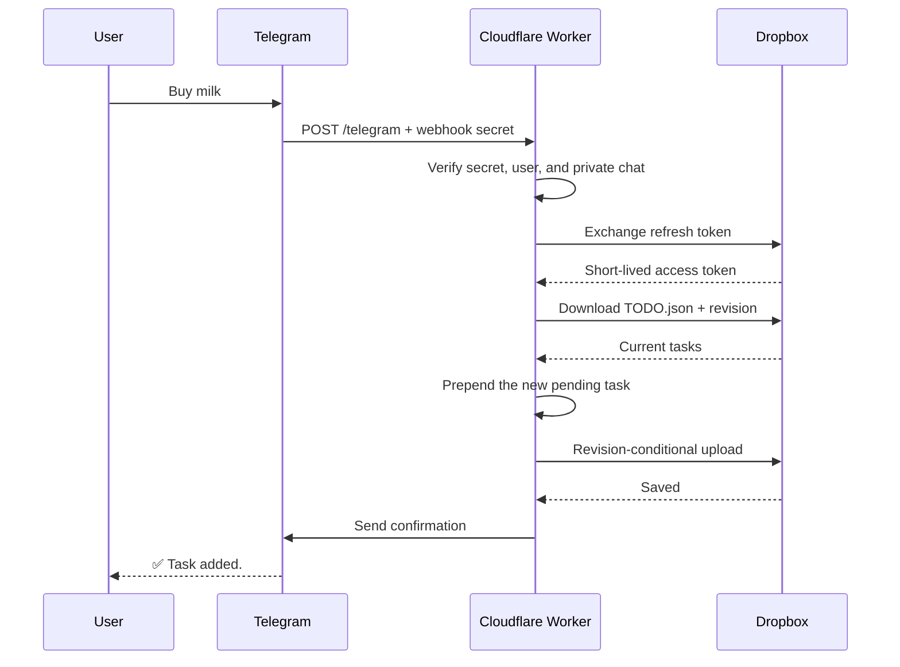

# update-todo

A Rust [Cloudflare Worker](https://developers.cloudflare.com/workers/languages/rust/) that turns private Telegram messages into tasks in the JSON file used by [Omado](https://github.com/tamayotchi/Omado).

```text
Telegram message      Cloudflare Worker                 Dropbox
"Buy milk"      ───▶ authenticate + prepend ───▶ Apps/Omado/TODO.json
      ▲                         │
      └──── "✅ Task added." ───┘
```

## How it works



The new task is inserted at the beginning of the array:

```json
{
  "title": "Buy milk",
  "completed": false
}
```

## Security and reliability

- Requires Telegram's webhook secret header and compares it in constant time.
- Accepts messages from one configured numeric Telegram user ID and private chat only.
- Stores credentials only in Cloudflare secrets.
- Requests short-lived Dropbox access tokens with an offline refresh token.
- Uses Dropbox revision-conditional uploads instead of blindly overwriting desktop changes.
- Retries write conflicts up to four times with exponential backoff.
- Refuses to overwrite malformed `TODO.json` data.
- Acknowledges unauthorized users without revealing data or causing Telegram retries.
- Does not retry a completed Dropbox write if its Telegram confirmation fails, preventing duplicate tasks.
- Contains no account-specific credentials and is safe to publish as a public repository.

## Prerequisites

- Rust and the `wasm32-unknown-unknown` target
- Node.js and npm
- A Cloudflare account
- A Telegram bot created with [BotFather](https://t.me/BotFather)
- A Dropbox API app

Install the local tools and dependencies:

```bash
rustup target add wasm32-unknown-unknown
cargo install worker-build --version 0.8.5 --locked
npm install
```

## 1. Configure Dropbox

The Worker uses `/TODO.json` inside the Dropbox app's private root. For an App Folder named `Omado`, the Dropbox desktop client exposes that file at:

```text
~/Dropbox/Apps/Omado/TODO.json
```

```text
Worker API path       Dropbox desktop path
/TODO.json      ───▶  ~/Dropbox/Apps/Omado/TODO.json
```

Create the app in the [Dropbox App Console](https://www.dropbox.com/developers/apps):

1. Select **Scoped access**.
2. Select **App folder** content access.
3. Use `Omado` as the app folder name.
4. Enable only these permissions:
   - `files.content.read`
   - `files.content.write`
5. Copy the app key and app secret.

App Folder access confines the token to `~/Dropbox/Apps/Omado`. The API path remains `/TODO.json` because Dropbox resolves it relative to that private app root.

### Get an offline refresh token

Open this URL after replacing `YOUR_APP_KEY`:

```text
https://www.dropbox.com/oauth2/authorize?client_id=YOUR_APP_KEY&response_type=code&token_access_type=offline
```

Approve access and copy the one-time authorization code. Exchange it immediately:

```bash
export DROPBOX_APP_KEY="your-app-key"
export DROPBOX_APP_SECRET="your-app-secret"
read -rsp "Dropbox authorization code: " DROPBOX_AUTH_CODE && echo

curl -fsS https://api.dropboxapi.com/oauth2/token \
  --user "$DROPBOX_APP_KEY:$DROPBOX_APP_SECRET" \
  --data-urlencode "code=$DROPBOX_AUTH_CODE" \
  --data "grant_type=authorization_code"
```

Save the `refresh_token` from the JSON response. Never commit it or paste it into an issue.

## 2. Find your Telegram user ID

Before registering the webhook, send your bot a private message and request its pending updates:

```bash
export TELEGRAM_BOT_TOKEN="your-bot-token"
curl -fsS "https://api.telegram.org/bot${TELEGRAM_BOT_TOKEN}/getUpdates"
```

Use the numeric `message.from.id` value. Do not use a username because usernames can change.

## 3. Configure Cloudflare

The Worker uses these bindings:

| Binding | Type | Purpose |
| --- | --- | --- |
| `TELEGRAM_BOT_TOKEN` | Secret | Sends bot replies |
| `TELEGRAM_WEBHOOK_SECRET` | Secret | Authenticates webhook requests |
| `TELEGRAM_ALLOWED_USER_ID` | Secret | Restricts access to one Telegram account |
| `DROPBOX_APP_KEY` | Secret | Identifies the Dropbox app |
| `DROPBOX_APP_SECRET` | Secret | Authenticates the Dropbox app |
| `DROPBOX_REFRESH_TOKEN` | Secret | Requests short-lived Dropbox access tokens |
| `DROPBOX_PATH` | Variable | Selects the todo JSON file |

Generate a webhook secret:

```bash
export TELEGRAM_WEBHOOK_SECRET="$(openssl rand -hex 32)"
```

Set all production secrets. Wrangler prompts for each value:

```bash
npx wrangler secret put TELEGRAM_BOT_TOKEN
npx wrangler secret put TELEGRAM_WEBHOOK_SECRET
npx wrangler secret put TELEGRAM_ALLOWED_USER_ID
npx wrangler secret put DROPBOX_APP_KEY
npx wrangler secret put DROPBOX_APP_SECRET
npx wrangler secret put DROPBOX_REFRESH_TOKEN
```

`DROPBOX_PATH` is non-sensitive and is configured in `wrangler.toml`:

```toml
[vars]
DROPBOX_PATH = "/TODO.json"
```

For local development, copy `.dev.vars.example` to `.dev.vars` and replace the placeholders. `.dev.vars` is ignored by Git.

## 4. Test and deploy

```bash
npm run check
npm run build
npm run deploy
```

The deployment prints a URL similar to:

```text
https://update-todo.<your-subdomain>.workers.dev
```

Health check:

```bash
curl -fsS "https://update-todo.<your-subdomain>.workers.dev/health"
```

Expected response:

```json
{"ok":true,"status":"healthy"}
```

## 5. Register the Telegram webhook

The value sent as `secret_token` must exactly match the `TELEGRAM_WEBHOOK_SECRET` stored in Cloudflare:

```bash
export WORKER_URL="https://update-todo.<your-subdomain>.workers.dev"

curl -fsS -X POST \
  "https://api.telegram.org/bot${TELEGRAM_BOT_TOKEN}/setWebhook" \
  --data-urlencode "url=${WORKER_URL}/telegram" \
  --data-urlencode "secret_token=${TELEGRAM_WEBHOOK_SECRET}" \
  --data-urlencode 'allowed_updates=["message"]'
```

Verify the registration:

```bash
curl -fsS "https://api.telegram.org/bot${TELEGRAM_BOT_TOKEN}/getWebhookInfo"
```

## Request flow

```text
POST /telegram
  verify X-Telegram-Bot-Api-Secret-Token
  decode the Telegram update
  if sender, chat ID, or chat type is not allowed
    acknowledge and ignore
  if the update has no non-empty text
    acknowledge and ignore
  if text is /start or /help
    send usage help
  if text is longer than 4,096 characters
    reject it
  otherwise
    exchange the Dropbox refresh token
    download and validate TODO.json
    prepend the task
    upload only if the Dropbox revision still matches
    retry revision conflicts up to four attempts
    send "✅ Task added."
```

## Behavior

| Input | Result |
| --- | --- |
| Non-empty private text from the allowed user | Prepended as a pending task |
| `/start` or `/help` | Sends usage information without creating a task |
| Empty or non-text update | Acknowledged and ignored |
| Message from another user or chat | Acknowledged and ignored |
| Text longer than 4,096 characters | Rejected with `400 Bad Request` |
| Invalid webhook secret | Rejected with `401 Unauthorized` |
| Malformed `TODO.json` | Fails without overwriting the file |
| Dropbox revision conflict | Re-downloads, reapplies, and retries the change |
| Confirmation failure after a saved task | Logs the failure and still acknowledges the update |

## Routes

| Method | Path | Purpose |
| --- | --- | --- |
| `GET` | `/` | Service identity |
| `GET` | `/health` | Health check |
| `POST` | `/telegram` | Telegram webhook |

## Project structure

```text
update-todo/
├── src/
│   ├── lib.rs          # routes and webhook orchestration
│   ├── config.rs       # validates Cloudflare bindings
│   ├── telegram.rs     # authentication, classification, and replies
│   ├── dropbox.rs      # OAuth, download, and conflict-safe upload
│   ├── todo.rs         # Omado task schema and JSON encoding
│   └── error.rs        # internal errors and public HTTP responses
├── .dev.vars.example   # local secret template
├── wrangler.toml       # Worker build and non-secret configuration
├── Cargo.toml          # Rust dependencies
└── package.json        # development commands
```

## Development

```bash
cp .dev.vars.example .dev.vars
npm run dev
```

Run Rust checks directly:

```bash
cargo fmt --check
cargo clippy --all-targets -- -D warnings
cargo test
```

## Revoking access

If any credential is exposed:

1. Revoke the Dropbox app under Dropbox connected apps and issue a new refresh token.
2. Revoke and regenerate the Telegram bot token with BotFather.
3. Replace the corresponding Cloudflare secrets.
4. Generate a new Telegram webhook secret and register the webhook again.

## License

MIT
